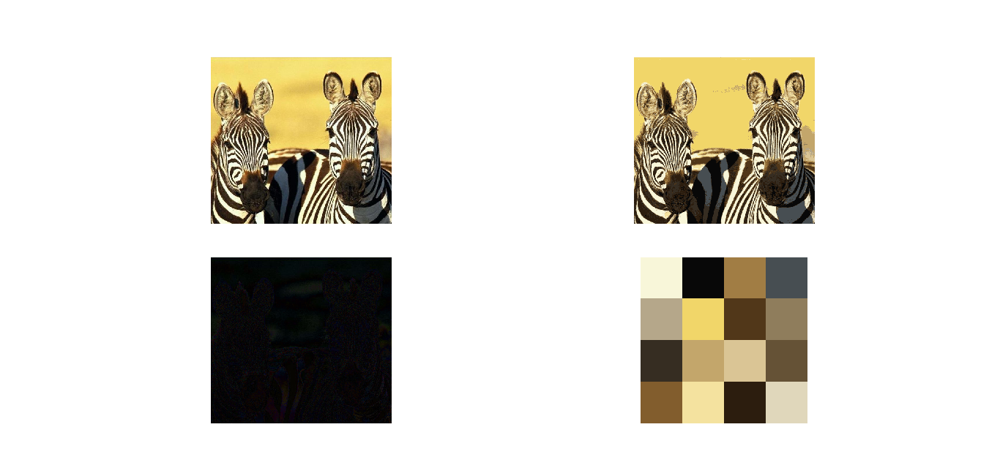

# weighted_sort_means
Based on Improving the Performance of K-Means for Color Quantization, by Celebi.

Basically solves a weighted version of K-Means, which works well for images and color (due to the color space usually being bounded). C++ is implemented with Minmax selection for the initial choice of means.

**TODO:** Implement method for initial choices besides Minmax.
